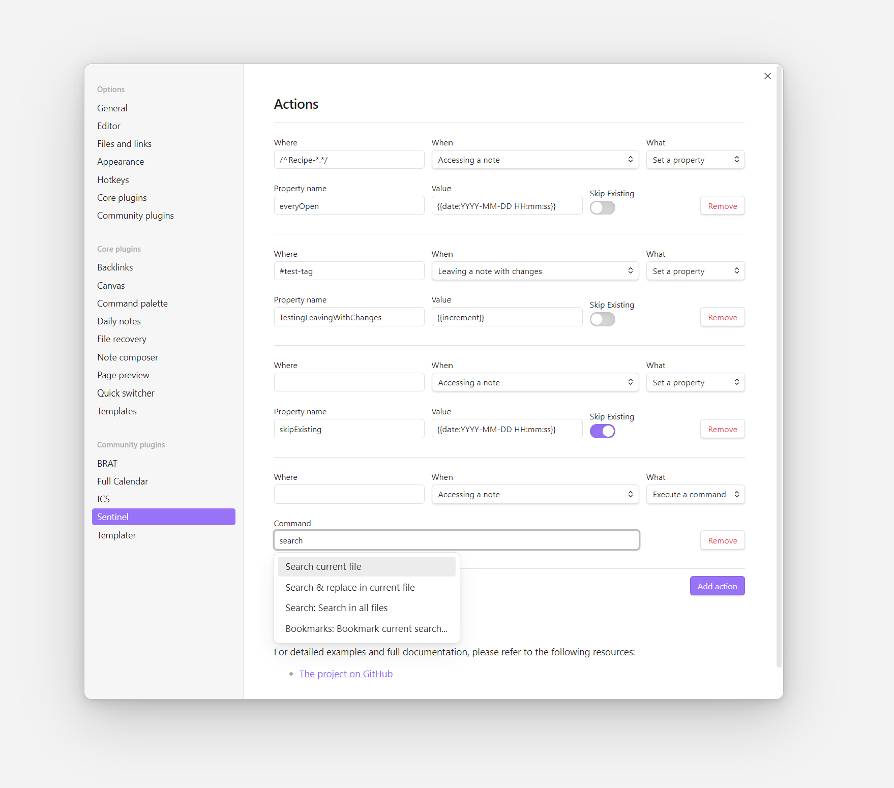

# Sentinel

Sentinel is a plugin for [Obsidian](https://obsidian.md) that allows you to **update properties** or **run commands** based on document visibility changes. For example, you can add a `views` property that auto-increments every time a Note opens, a `modified` property that captures the current datetime when you exit a Note with modifications, run a Linter when a Note opens or exits, and so on. 

https://github.com/user-attachments/assets/eb7f4ae7-2448-4ca1-913a-9b63d799f8bf

## How to use
Go to the plugin's settings to add your actions. Each action includes the following fields:
* **Where**: Which notes should be targeted. If left empty, it will run on all Notes. You can target specific notes based on their names, their containing folder or their name, or use a regex to target Notes with specific patterns on their title. More specifically, you can target with the following parameters:
  * `#tag` - Prefixing the value with a `#` (e.g. `#tag`) will match notes that have the specified tag. For example, `#tag-1` would trigger the action on any note that includes the tag "tag-1".
  * `Folder/` - Putting `/` at the end of your value (e.g. `folder/`), will target notes within the specified folder. You can target nested folders like `folder/subfolder/`. For example, `My Folder/` would target all notes under the "My Folder" folder, and `My Folder/Subfolder` all the notes under the specific subfolder. 
  * `Note name` - Putting plain text (e.g. `Note Name`) will target a note with the exact title (case-insensitive)
  * **Negative targeting** - The above conditions can be used for negative targeting, by prefixing them with `!`. For example, `!#tag-1` will trigger on any note EXCEPT for those containing the tag "tag-1". `!My Folder/` will trigger on any note EXCEPT for those under the "My Folder" folder. `!My Note` will trigger on any notes EXCEPT for the note with the title "My Note". 
  * **Multiple targeting** - You can use commas to combine multiple conditions. For example, `#tag-1,folder/,Note Name` will trigger if the note matches ANY of these conditions (has "tag-1" OR is in "folder" OR has the specified name). On the other hand, `!#tag-1,!folder/,!Note Name` would trigger only if ALL conditions are true (note doesn't have "tag-1" AND isn't in "folder" AND isn't named "Note Name").
  * **Regular expressions** - For even more complex targeting, you can use standard regular expressions. For example, `/^Recipe-*.*/` would target all notes with a title beginning with "Recipe-").
* **When**: When should the action run. The options include:
	* **Accessing a note**: The action will run every time a Note is accessed. 
    * **Opening a note once, reset on closing Obsidian**: The action will run the first time a note opens, but not for any consecutive times. It will re-trigger only after Obsidian is closed and re-open.
    * **Opening a note once, reset on closing the note**: The action will run the first time a note opens, but not for any consecutive times. It will re-trigger when the note is closed and re-open.
    * **Exiting a note (once)**: The action will run when the user exits a note for the first time.
    * **Exiting a note with changes**: The action will run every time the user exits a note after having done changes to it. 
* **What**: What should the action do. There are two options:
  * **Set a property**: You can update a specific property. By selecting this option, you will be asked to add the property's name, and the value. The value can either be a hardcoded string, or a dynamic variable, like `{{increment}}`, `{{date}}`, `{{time}}` or `{{title}}`. 
  * **Execute a command**: This will ask you to select a specific command from a dropdown, which will be automatically triggered. The list includes all the available commands from the Command Palette, so you should make sure to choose something that makes sense.  

## Available variables
The property option accepts the following dynamic variables:
### Date/time
Both `{{date}}` and `{{time}}` allow you to change the default format using a format string. To set a format string, add a colon (:) followed by a string of Moment.js format tokens, for example `{{date:YYYY-MM-DD}}`.

You can use `{{date}}` and `{{time}}` interchangeably with format strings, for example `{{time:YYYY-MM-DD}}`.

Essentially, it follows the same patterns described in the [Template variables](https://help.obsidian.md/Plugins/Templates#Template+variables) section of the Obsidian Help pages. 

### Increment
Using `{{increment}}` you can increment a specific value. This can be handy if you want to add a property for tracking the views of a Note. The variable allows you to set the starting value and the increment step, with the following pattern: `{{increment:<initial_value>,<increment_step>}}`. For example, `{{increment:100,10}}`, would use "100" as its initial value, and increment by "10" (so, on your next visit, the value should be "110", then "120" and so on). 

If no other parameters are used, it will use by default "0" as the initial value and "1" as the increment step. 

### Title
You can use `{{title}}` to retrieve the title of the active note. Nothing fancy here, and I'm not sure when would one need it. I just kept it because it was among the officially supported [Template variables](https://help.obsidian.md/Plugins/Templates#Template+variables).

## How to install
Currently, there are 3 ways to install the plugin:

### Standard install (recommended)
1. Open the Settings panel in Obsidian, and go to the "Community plugins" section.
2. Click the "Browse" button and search for "Sentinel".
3. Install and enable the plugin.

### Using BRAT
1. Install the [BRAT](https://github.com/TfTHacker/obsidian42-brat) plugin.
2. Add the Sentinel repository to BRAT: `gsarig/obsidian-sentinel`.

### Manually
1. Downlaod `main.js`, `styles.css`, `manifest.json` files from the [latest release](https://github.com/gsarig/obsidian-sentinel/releases).
2. Create new folder inside your vault's `/.obsidian/plugins/` named  `sentinel` . If plugins folder doesn't exist, then create it manually. 
3. Move downloaded files into the `/sentinel` folder. 
4. Enable the plugin in ObsidianMD. 

## Beta testing
You can use BRAT to test beta versions of the plugin:
1. Install the [BRAT](https://github.com/TfTHacker/obsidian42-brat) plugin.
2. Check the [manifest-beta.json](https://github.com/gsarig/obsidian-sentinel/blob/main/manifest-beta.json) file to see the current beta version. It should be something like `1.0.2-beta.1`.
3. Go to BRAT and add the plugin using the option "Add Beta plugin with frozen version":

## Feedback and Support

If you encounter any issues or have questions, feel free to reach out via the plugin's [GitHub repository](https://github.com/gsarig/obsidian-sentinel/).
